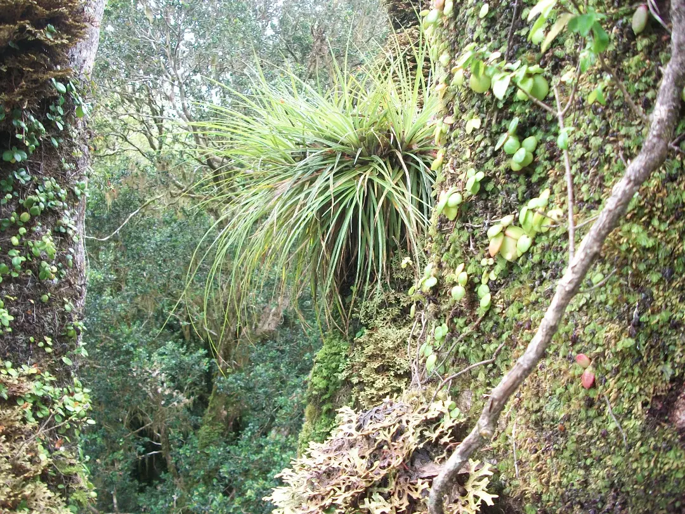
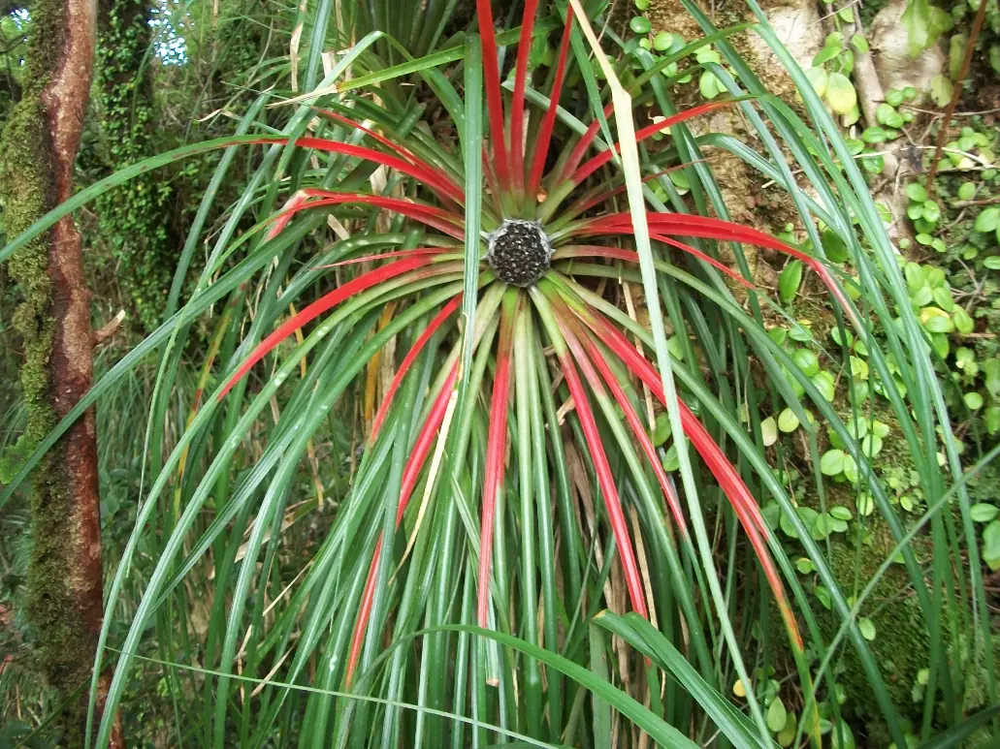
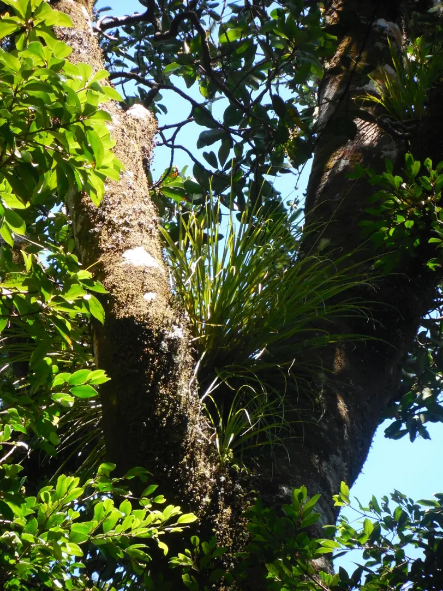

## Información taxonómica {.species-title}

::: {.species-info}

Familia
: Bromeliaceae

Nombre común
: Chupalla, poe, puñeñe

Forma de crecimiento
: Epífita

Distribución
: V-X Regiones

:::

## Descripción

Epífita de gran tamaño, común en bosques costeros del tipo Valdiviano y asociada a la presencia de árboles antiguos. Hojas largas, dispuestas en forma de roseta, con espinas en los bordes y de color verde claro. En época de floración las hojas se tornan rojas en la base (de ahí su nombre “bicolor”) , produciendo en el centro múltiples flores celestes. Es frecuente ver agrupaciones de múltiples rosetas de esta planta creciendo juntas. Los frutos son similares a los de su pariente terrestre el “chupón” (Greigia sphacelata), pero de pequeño tamaño.

### Floración

Febrero

### Fructificación

Marzo a Abril

### Estado de conservación

Vulnerable

## Galería

::: {.gallery}
{group="fascicularia-bicolor"}

{group="fascicularia-bicolor"}

{group="fascicularia-bicolor"}
:::

### Mapa de distribución en Chile
```{r}
#| echo: false
#| results: asis
species_name <- tools::file_path_sans_ext(basename(knitr::current_input()))
cat(sprintf(
  '<iframe data-external="1" src="../mapas/%s.html" width="100%%" height="600px" style="border:none;"></iframe>',
  species_name))
geolibre_url <- sprintf(
  "https://web.geolibre.app/?url=%s",
  utils::URLencode(
    sprintf("https://epifitas.cl/geolibre/%s.geolibre.json", species_name),
    reserved = TRUE))
cat(sprintf(
  '<p><a href="%s" target="_blank" rel="noopener">Explorar datos de ocurrencia en GeoLibre</a></p>',
  geolibre_url))
```

## Bibliografía

::: {.bibliografia}
- Armesto JJ., J Díaz-Forester, C Tejo Haristoy, JL Celis-Diez. 2011.Botánica ecológica. Guía de Campo de la flora leñosa de Chiloé. IEB. Santiago, Chile. 161 p.Marticorena A., D Alarcón, L Abello, C Atala. 2010. Plantas trepadoras, epífitas y parásitas nativas de Chile. Guía de Campo. Ed. Corporación Chilena de la Madera, Concepción, Chile, 291 p.
:::