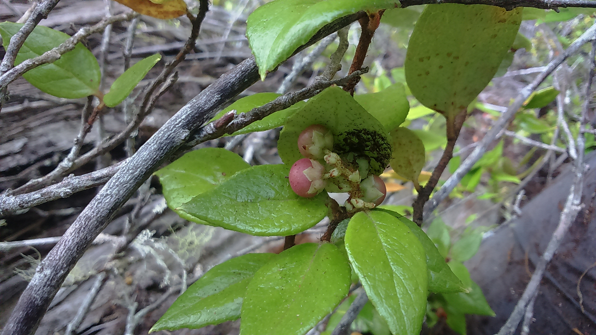
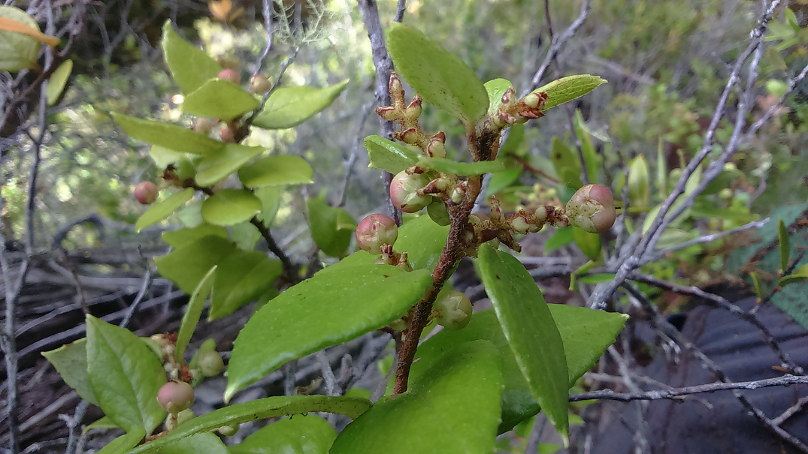

## Información taxonómica {.species-title}

::: {.species-info}

Familia
: Ericaceae

Nombre común
: Hued-hued, Chaura

Forma de crecimiento
: Arbusto, eventualmente epífito

Distribución
: VII-XII Regiones, con una población aislada en la II Región

:::

## Descripción

Arbusto que alcanza hasta 1,5 m, estolonífero, relativamente común en hábitats cordilleranos y más bien expuestos de su área de distribución, típica del sotobosque. Se le puede encontrar comúnmente creciendo de forma epífita en alerces (Fitzroya cupressoides), en donde crece incluso en alturas cercanas a los 20m en los fustes y ramas. Hojas ovado-oblongas, pilosas, de unos 5 cm de largo por 2,5 cm de ancho, coriáceas, de color verde oscuro, con un mucrón en la punta. Flores blancas, pequeñas, dispuestas en racimos densos. Especie dioica, flores unisexuales. Los frutos son bayas de color morado al madurar, conteniendo en su interior numerosas semillas minúsculas. Probablemente sean consumidos por micromamíferos y aves, los que dispersan las semillas.

### Floración

Octubre-Noviembre

### Fructificación

Noviembre-Enero

### Estado de conservación

No Amenazada

## Galería

::: {.gallery}
{group="gaultheria-insana"}

{group="gaultheria-insana"}
:::

### Mapa de distribución en Chile
```{r}
#| echo: false
#| results: asis
species_name <- tools::file_path_sans_ext(basename(knitr::current_input()))
cat(sprintf(
  '<iframe data-external="1" src="../mapas/%s.html" width="100%%" height="600px" style="border:none;"></iframe>',
  species_name))
geolibre_url <- sprintf(
  "https://web.geolibre.app/?url=%s",
  utils::URLencode(
    sprintf("https://epifitas.cl/geolibre/%s.geolibre.json", species_name),
    reserved = TRUE))
cat(sprintf(
  '<p><a href="%s" target="_blank" rel="noopener">Explorar datos de ocurrencia en GeoLibre</a></p>',
  geolibre_url))
```

## Bibliografía

::: {.bibliografia}
- Armesto JJ., J Díaz-Forester, C Tejo Haristoy, JL Celis-Diez. 2011.Botánica ecológica. Guía de Campo de la flora leñosa de Chiloé. IEB. Santiago, Chile. 161 p.
- Teillier S, Escobar, F. 2013. Revisión del género Gaultheria L.(Ericaceae) en Chile. Gayana. Botánica, 70(1), 136-153.
:::

---

*Autor de la ficha: Diego Penneckamp Furniel.Citar como: Penneckamp D. 2017. Gaultheria insana. Disponible en: [http://epifitas.cl/gaultheria-insana/*