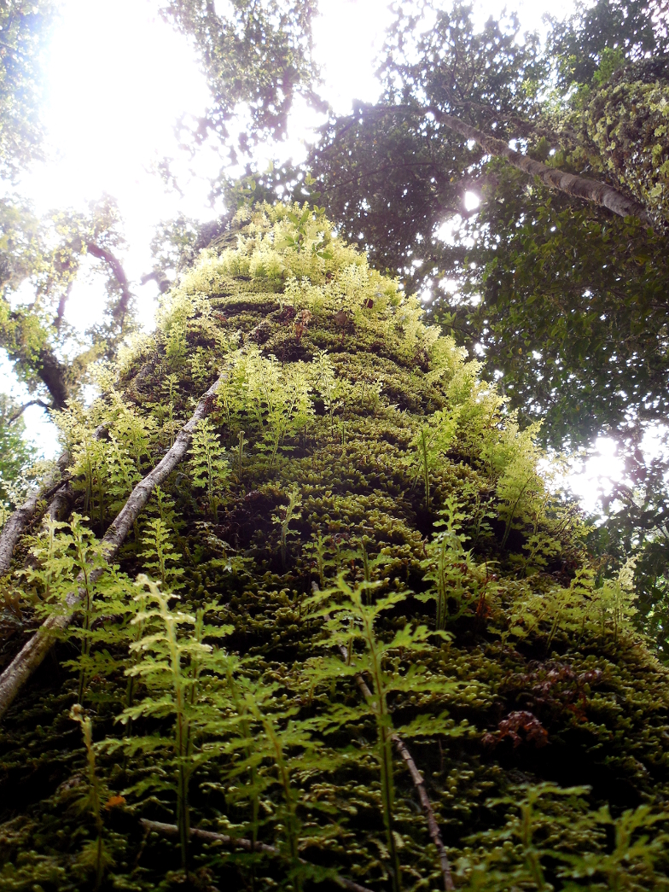

## Información taxonómica {.species-title}

::: {.species-info}

Familia
: Hymenophyllaceae

Nombre común
: Helecho película, pallante chilote

Forma de crecimiento
: Epífito

Distribución
: VIII- XII regiones, también en el Archipiélago de Juan Fernández

:::

## Descripción

Helecho epifito, común en bosques costeros y andinos. Hojas de entre 10 a 25 cm de largo, en algunos casos excepcionales alcanzan sobre 40 cm (Como en Isla Mocha, VIII región). Rizoma rastrero rígido, marrón oscuro. Peciolo y raquis alados, lámina lanceolada, bipinnada a tripinnatifída, lacinias terminales de las pinas y del ápice de la lámina generalmente muy alargadas (De ahí el nombre “caudiculatum” o “caudicula”= cola, colita). Soros muy grandes subaxilares insertos en lacinias reducidas, indusios redondeados de borde entero. 40-90 esporangios por soro. H. caudiculatum ha sido registrado creciendo desde la base hasta los 15 m de altura en los fustes de ulmos costeros en Chiloé.

### Estado de conservación

Vulnerable.

## Galería

::: {.gallery}
{group="hymenophyllum-caudiculatum"}

{group="hymenophyllum-caudiculatum"}
:::

### Mapa de distribución en Chile
```{r}
#| echo: false
#| results: asis
species_name <- tools::file_path_sans_ext(basename(knitr::current_input()))
cat(sprintf(
  '<iframe data-external="1" src="../mapas/%s.html" width="100%%" height="600px" style="border:none;"></iframe>',
  species_name))
geolibre_url <- sprintf(
  "https://web.geolibre.app/?url=%s",
  utils::URLencode(
    sprintf("https://epifitas.cl/geolibre/%s.geolibre.json", species_name),
    reserved = TRUE))
cat(sprintf(
  '<p><a href="%s" target="_blank" rel="noopener">Explorar datos de ocurrencia en GeoLibre</a></p>',
  geolibre_url))
```

## Bibliografía

::: {.bibliografia}
- Diem, J., & de Lichtenstein, J. S. 1959. Las Himenofiláceas del área argentino-chilena del sud. Darwiniana, 611-760.Díaz, I. A., Sieving, K. E., Pena-Foxon, M. E., Larraín, J., & Armesto, J. J. 2010. Epiphyte diversity and biomass loads of canopy emergent trees in Chilean temperate rain forests: A neglected functional component. Forest Ecology and Management, 259(8), 1490-1501.
- Rodríguez, R., D. Alarcón y J. Espejo. 2009. Helechos Nativos del Centro y Sur de Chile. Guía de Campo. Ed. Corporación Chilena de la Madera, Concepcion, Chile, 212 p.
:::