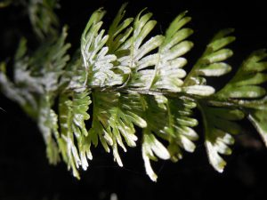

## Información taxonómica {.species-title}

::: {.species-info}

Familia
: Hymenophyllaceae

Nombre común
: Helecho película, helecho peineta

Forma de crecimiento
: Epífito, epipetrico

Distribución
: VII-XII regiones

:::

## Descripción

Helecho epifito de entre 5 -20 cm, crece en bosques húmedos y más bien sombríos. Rizoma rastrero rigido de color café oscuro. Peciolos oscuros, glabros cuando adultos y con abundantes pelos en etapas tempranas. Láminas lanceoladas, bipinnadas. Pinas compuestas por lacinias lineales, paralelas entre si, de margenes dentados. Soros insertos en el ápice de las lacinias, indusios aovados, de margenes enteros. 35-45 esporangios por soro. H. pectinatum puede crecer hasta los 13 m en el fuste de árboles de bosques costeros en Chiloé.

### Estado de conservación

No existen revisiones sobre esta especie.

## Galería

::: {.gallery}
{group="hymenophyllum-pectinatum"}

{group="hymenophyllum-pectinatum"}

{group="hymenophyllum-pectinatum"}
:::

### Mapa de distribución en Chile
```{r}
#| echo: false
#| results: asis
species_name <- tools::file_path_sans_ext(basename(knitr::current_input()))
cat(sprintf(
  '<iframe data-external="1" src="../mapas/%s.html" width="100%%" height="600px" style="border:none;"></iframe>',
  species_name))
geolibre_url <- sprintf(
  "https://web.geolibre.app/?url=%s",
  utils::URLencode(
    sprintf("https://epifitas.cl/geolibre/%s.geolibre.json", species_name),
    reserved = TRUE))
cat(sprintf(
  '<p><a href="%s" target="_blank" rel="noopener">Explorar datos de ocurrencia en GeoLibre</a></p>',
  geolibre_url))
```

## Bibliografía

::: {.bibliografia}
- Diem, J., & de Lichtenstein, J. S. 1959. Las Himenofiláceas del área argentino-chilena del sud. Darwiniana, 611-760.Díaz, I. A., Sieving, K. E., Pena-Foxon, M. E., Larraín, J., & Armesto, J. J. 2010. Epiphyte diversity and biomass loads of canopy emergent trees in Chilean temperate rain forests: A neglected functional component. Forest Ecology and Management, 259(8), 1490-1501.
- Rodríguez, R., D. Alarcón y J. Espejo. 2009. Helechos Nativos del Centro y Sur de Chile. Guía de Campo. Ed. Corporación Chilena de la Madera, Concepcion, Chile, 212 p.
:::