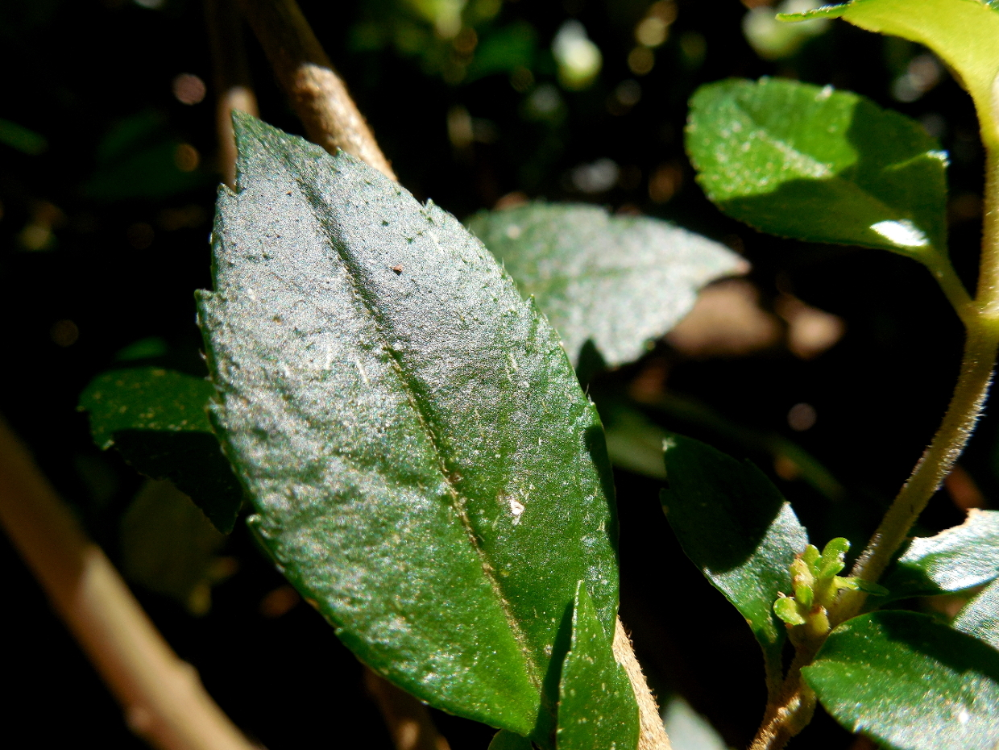
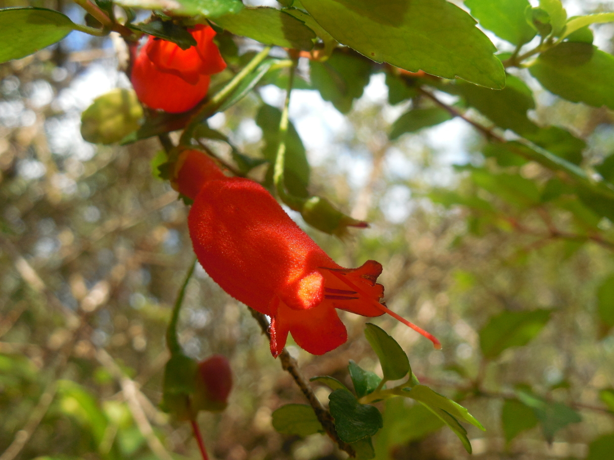
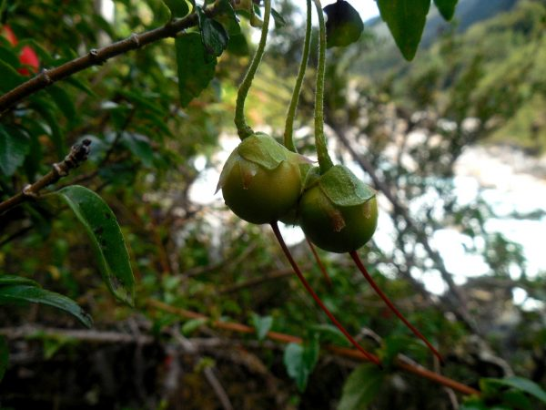

## Información taxonómica {.species-title}

::: {.species-info}

Familia
: Gesneriaceae

Nombre común
: Botellita, voquivoqui, boche-boche

Forma de crecimiento
: Trepadora, epífito facultativo

Distribución
: VII-XII regiones, también en el bosque de Fray Jorge (IV región)

:::

## Descripción

Planta trepadora leñosa, puede formar pequeños arbustos creciendo sobre el suelo y suele trepar por los troncos de grandes árboles. Sus hojas son de color verde brillante, opuestas, ovado-oblongas, de bordes aserrados. Sus flores son tubulares, de color rojo naranjo, péndulas. Debido al color, sus flores son muy atractivas para los picaflores. Sus frutos son bayas globosas, verdes, que son consumidos por el monito del monte quien dispersa las semillas. Sus hojas y corteza son usadas con fines medicinales, y en conjunto con sus flores suelen ser utilizados para teñir lanas de color plomizo y negro.

### Floración

Octubre – Diciembre

### Fructificación

Enero- Mayo

### Estado de conservación

No existen revisiones sobre esta especie.

## Galería

::: {.gallery}

:::

## Bibliografía

::: {.bibliografia}
- Armesto JJ., J Díaz-Forester, C Tejo Haristoy, JL Celis-Diez. 2011.Botánica ecológica. Guía de Campo de la flora leñosa de Chiloé. IEB. Santiago, Chile. 161 p.Cárdenas R. & C. Villagrán. 2005. Chiloé, Botánica de la Cotidianidad. Consejo Nacional del Libro y la lectura. Chile, 365 p.Marticorena A., D Alarcón, L Abello, C Atala. 2010. Plantas trepadoras, epífitas y parásitas nativas de Chile. Guía de Campo. Ed. Corporación Chilena de la Madera, Concepción, Chile, 291 p.
:::