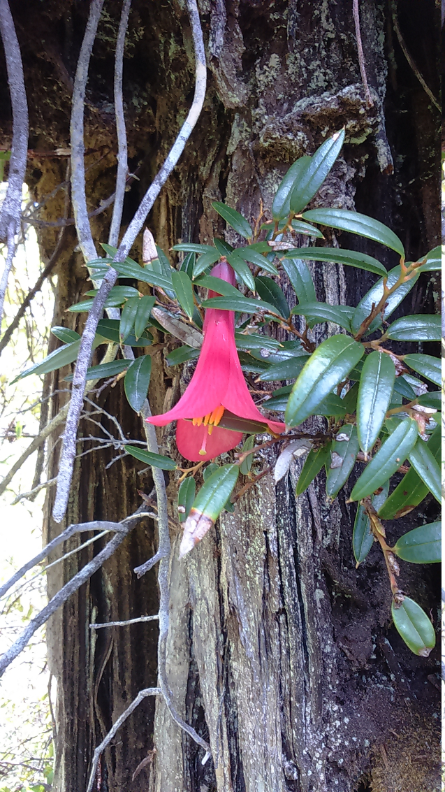
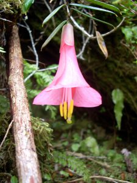
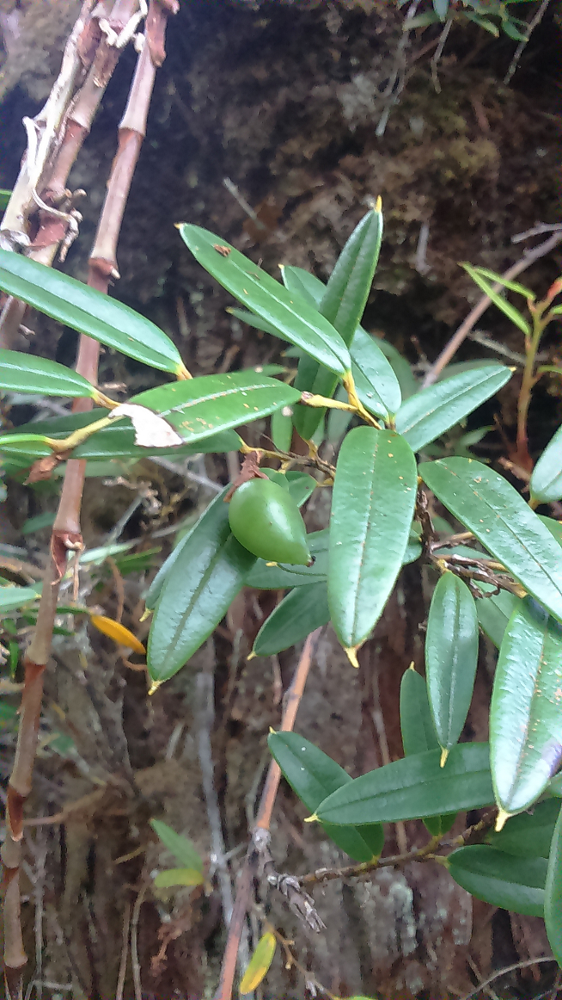

## Información taxonómica {.species-title}

::: {.species-info}

Familia
: Philesiaceae

Nombre común
: Coicopihue, copihue chilote

Forma de crecimiento
: Trepador apoyante, también puede ser encontrado como epífito

Distribución
: XIV-XII regiones

:::

## Descripción

Arbusto muy asociado a bosques húmedos de Alerce (Fitzroya cupressoides), en donde ha sido reportado como una especie dominante del dosel de alerces andinos. Hojas alternas, son coráceas, oblongas, de margen entero, y mucronadas. Sus flores son péndulas, grandes, acampanadas, y rosadas. Sus frutos corresponden a bayas globosas elipsoides.

### Floración

Diciembre- Abril

### Fructificación

Marzo- Junio

### Estado de conservación

No existen revisiones sobre esta especie.

## Galería

::: {.gallery}
{group="philesia-magellanica"}

{group="philesia-magellanica"}

{group="philesia-magellanica"}
:::

### Mapa de distribución en Chile
```{r}
#| echo: false
#| results: asis
species_name <- tools::file_path_sans_ext(basename(knitr::current_input()))
cat(sprintf(
  '<iframe data-external="1" src="../mapas/%s.html" width="100%%" height="600px" style="border:none;"></iframe>',
  species_name))
geolibre_url <- sprintf(
  "https://web.geolibre.app/?url=%s",
  utils::URLencode(
    sprintf("https://epifitas.cl/geolibre/%s.geolibre.json", species_name),
    reserved = TRUE))
cat(sprintf(
  '<p><a href="%s" target="_blank" rel="noopener">Explorar datos de ocurrencia en GeoLibre</a></p>',
  geolibre_url))
```

## Bibliografía

::: {.bibliografia}
- Armesto JJ, J Díaz-Forester, C Tejo Haristoy, JL Celis-Diez. 2011.Botánica ecológica. Guía de Campo de la flora leñosa de Chiloé. IEB. Santiago, Ch.
- ile. 161 p.Marticorena A, D Alarcón, L Abello, C Atala. 2010. Plantas trepadoras, epífitas y parásitas nativas de Chile. Guía de Campo. Ed. Corporación Chilena de la Madera, Concepción, Chile, 291 p.
- Clement JP, M Moffett, D Shaw, A Lara, D Alarcón, O Larrain. 2001. Crown Structure and Biodiversity in Fitzroya cupressoides, the Giant Conifers of Alerce Andino National Park, Chile. Selbyana, 76-88.
:::