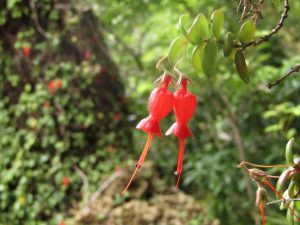
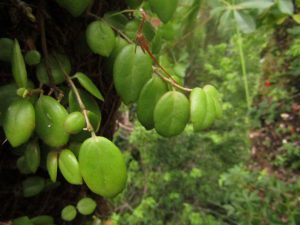
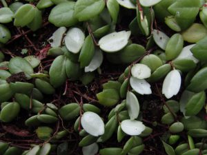

## Información taxonómica {.species-title}

::: {.species-info}

Familia
: Gesneriaceae

Nombre común
: Medallita

Forma de crecimiento
: Epífita

Distribución
: IV-XI regiones

:::

## Descripción

Planta completamente epífita, endémica de los Bosques Templados de Sudamérica. Hojas redondeadas de color verde claro, algunas con el ápice o extremo superior dentado, miden alrededor de 2 cm de largo, muy carnosas, suculentas. El envés es glauco. Flores rojas anaranjadas globosas y solitarias. Debido a su color, los picaflores son atraídos hacia ellas, también insectos polinizadores como Bombus dahlbomii. Los frutos corresponden a capsulas ovadas de color amarillo. Los frutos son consumidos exclusivamente por Monito del monte (Dromiciops gliroides). Gracias a la particularidad de sus hojas suculentas, S. scandens puede crecer en las zonas más altas y expuestas del dosel, alcanzando incluso los 23 m.

### Estado de conservación

No existen revisiones sobre esta especie.

## Galería

::: {.gallery}
{group="sarmienta-scandens"}

{group="sarmienta-scandens"}

{group="sarmienta-scandens"}
:::

### Mapa de distribución en Chile
```{r}
#| echo: false
#| results: asis
species_name <- tools::file_path_sans_ext(basename(knitr::current_input()))
cat(sprintf(
  '<iframe data-external="1" src="../mapas/%s.html" width="100%%" height="600px" style="border:none;"></iframe>',
  species_name))
geolibre_url <- sprintf(
  "https://web.geolibre.app/?url=%s",
  utils::URLencode(
    sprintf("https://epifitas.cl/ocurrencias/%s.csv", species_name),
    reserved = TRUE))
cat(sprintf(
  '<p><a href="%s" target="_blank" rel="noopener">Explorar datos de ocurrencia en GeoLibre</a></p>',
  geolibre_url))
```

## Bibliografía

::: {.bibliografia}
- Armesto JJ., J Díaz-Forester, C Tejo Haristoy, JL Celis-Diez. 2011.Botánica ecológica. Guía de Campo de la flora leñosa de Chiloé. IEB. Santiago, Chile. 161 p.
- Díaz, I. A., Sieving, K. E., Pena-Foxon, M. E., Larraín, J., & Armesto, J. J. 2010. Epiphyte diversity and biomass loads of canopy emergent trees in Chilean temperate rain forests: A neglected functional component. Forest Ecology and Management, 259(8), 1490-1501.
- Marticorena A., D Alarcón, L Abello, C Atala. 2010. Plantas trepadoras, epífitas y parásitas nativas de Chile. Guía de Campo. Ed. Corporación Chilena de la Madera, Concepción, Chile, 291 p.
:::